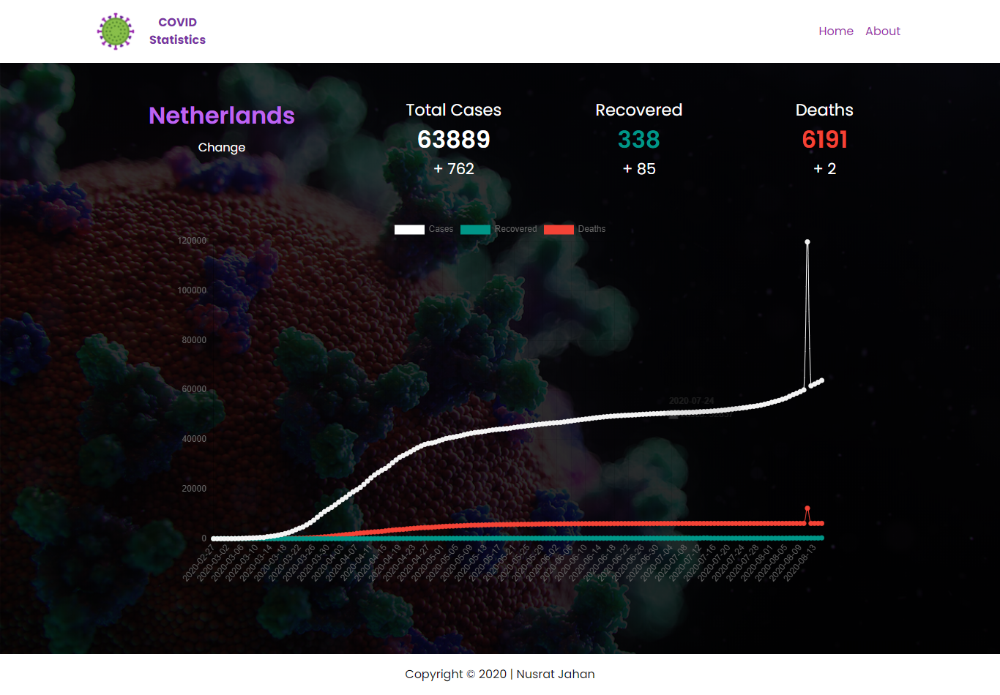
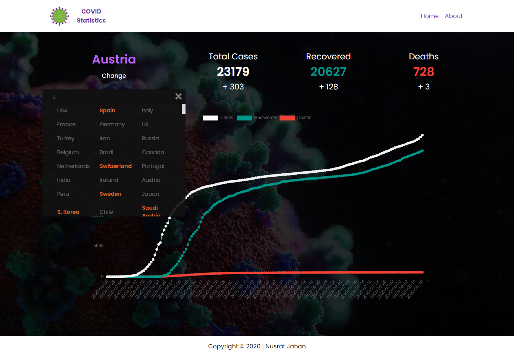

## COVID-19 Statistics

<div align="center">

</div>

<br>

<div align="center">

  

</div>

## :rocket: Building and Running for Production
1.Generate a full static production build
```bash
node script.js
```
2.Preview the site as it will appear once deployed
```bash
open with live server
```

<div align="center">

</div>

## :fork_and_knife: Forking this repo
<p>I value keeping this site open source, but as you all know <span style="color:red"><em><b>:x: plagiarism is bad :x:</b></em></span>. I spent a non-negligible amount of effort developing, designing, and trying to perfect this iteration of my website, and I am proud of it! All I ask is to not claim this effort as your own.

There are some cases, such as using this code for a business or something that is greater than a personal project, that I may be less comfortable saying `yes` to. If in doubt, please don't hesitate to ask me. 

So, feel free to :fork_and_knife: `fork` this repo.
</p>
